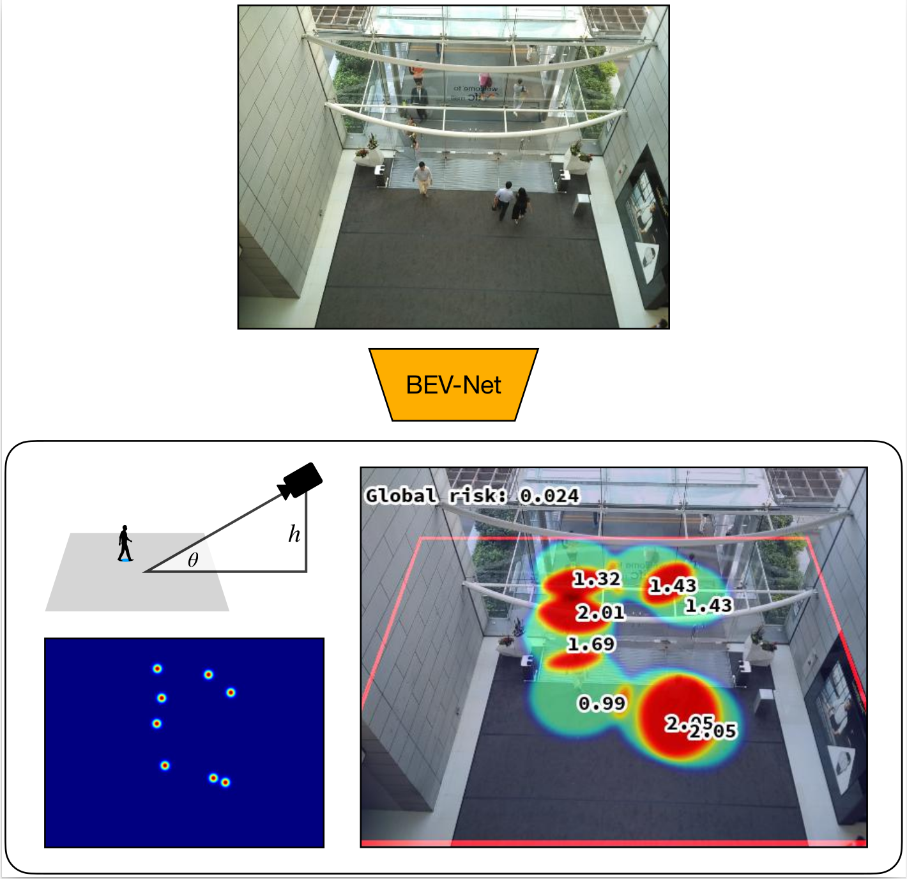

BEV-Net: Assessing Social Distancing Compliance by Joint People Localization and Geometric Reasoning
======

PyTorch implementation of ICCV2021 paper, *BEV-Net: Assessing Social 
Distancing Compliance by Joint People Localization and Geometric Reasoning*, 
for estimating camera pose and analysing social distancing compliance with 
geometric reasoning:



# Setup

## Prerequisites

- Windows or Linux
- NVIDIA GPU + CUDA cuDNN

## Create Environment

### Linux

```shell
bash create_env.bash
```

### Windows

```shell
Set-ExecutionPolicy unrestricted
create_env.ps1
```

## Download Data

```shell
git submodule update --init --recursive ./data
```

## Prepare Dataset (Optional)

Dataset should be ready when the submodule at `data` is pulled.

```shell
python src/datasets/cityuhk/build_dataset.py
python src/datasets/cityuhk/build_datalist.py
```

## Download Checkpoints (Optional)

We provide all the checkpoints of models we used, including the baselines.
```shell
git submodule update --init --recursive ./checkpoints_tar_parts
```

## Uncompress Checkpoints (Optional)

- Linux
```shell
bash uncompress_checkpoints.bash
```
- Windows: you may need to use tools like `7zip` to uncompress the files.

We also provide the bash script to compress the checkpoints again. So, you 
can delete `checkpoints_tar_parts` if you like to.

# How to use

## Train Models

```shell
python ./src/train.py \
    --task-option-file ./configs/bevnet/mixed-all.yaml --use-gpus 0
```

## Test Models

- Generate model output for the test dataset and calculate losses
```shell
python src/test.py \
    --task-option-file checkpoints/BEVNet-all/mixed/option.yaml --use-gpus 0
```
- Generate visualization of the model output
```shell
python src/visualize_model_output.py \
    --model-output-file log/test/BEVNet-all/mixed/test/model-output.h5 -j 8
```
- Run the SDCA metrics
```shell
python src/run_metrics.py \
        --task-option-file checkpoints/BEVNet-all/mixed/option.yaml \
        --model-output-file log/test/BEVNet-all/mixed/test/model-output.h5 \
        --output-csv log/test/metric_result.csv \
        --use-gpu 0
```

**To test all the provided models, run the script**:
- Linux
```shell
bash test_models.bash
```
- Windows
```shell
test_models.ps1
```
